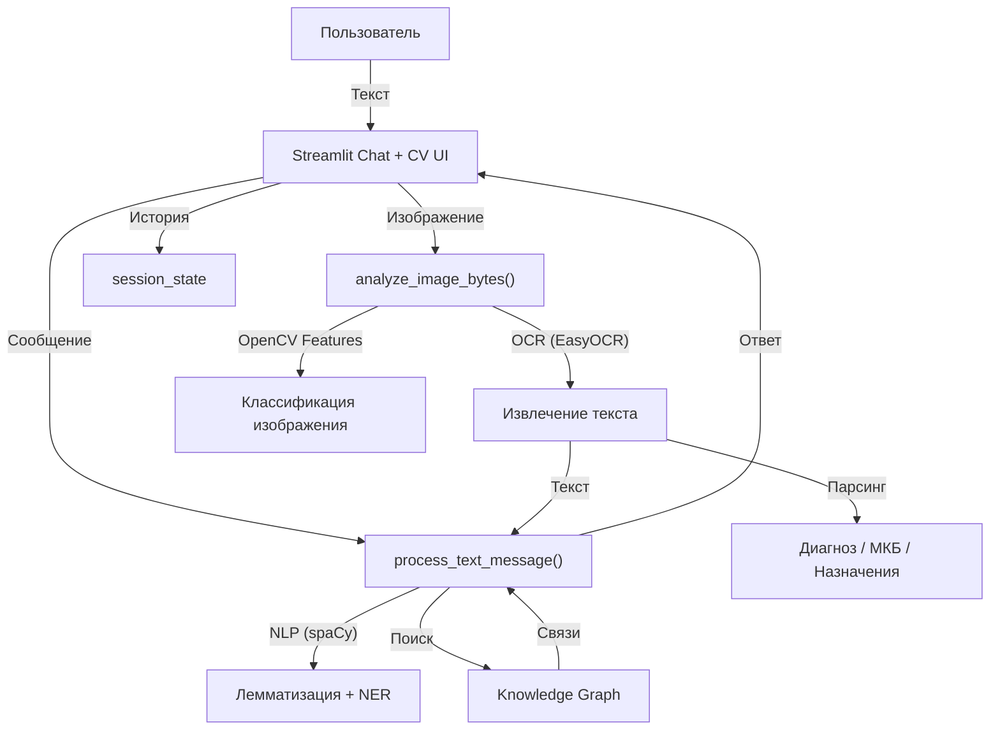

# KambI4-PRIS-2026-DutbayevKamil-ZakiryanovaKamila-MedDiagnost

# MedDiagnost 🩺

Учебная интеллектуальная система первичной медицинской оценки,
разрабатываемая в рамках дисциплины
**«Проектирование и разработка интеллектуальных систем»**.

Система используется исключительно в учебных целях
и не является медицинским инструментом.

---

## 1. Описание проекта

**MedDiagnost** демонстрирует эволюцию интеллектуальной системы от:

* продукционной модели (Rule-Based Logic),
* объектно-ориентированной модели (OOP),
* графа знаний (Knowledge Graph),
* диалогового интерфейса (Chatbot),
* к гибридной системе с компонентом NLP (Sub-symbolic AI).

Проект сочетает **символический ИИ (граф, правила)**
и **субсимволический ИИ (NLP + Computer Vision)**.

---

## 2. Лабораторная работа №1

### Инициализация проекта

* создан Git-репозиторий;
* настроено окружение (Python, Git, VS Code);
* разработана структура проекта;
* реализован базовый интерфейс на Streamlit;
* оформлен README.

---

## 3. Лабораторная работа №2

### Продукционная модель и база знаний

Реализована система правил вида **if–then**.

Компоненты:

* `mock_data.py` — имитация данных пациента;
* `rules.json` — база знаний;
* `logic.py` — inference engine;
* Hard Filter (критическая проверка);
* интерактивный интерфейс для тестирования сценариев.

---

## 4. Лабораторная работа №3

### Объектная модель и граф знаний

Реализована предметная модель медицины:

* `dataclass Disease` (болезнь, симптомы, лекарства);
* граф знаний на базе **NetworkX**;
* узлы: болезни, симптомы, лекарства;
* связи: болезнь ↔ симптомы, болезнь ↔ лечение.

Граф позволяет:

* по симптому находить возможные заболевания;
* по заболеванию получать связанные симптомы;
* исследовать контекст медицинских связей.

---

## 5. Лабораторная работа №4

### Диалоговый интерфейс (Chatbot)

Реализован чат-бот на Streamlit:

* `st.chat_input`
* `st.chat_message`
* история переписки через `session_state`
* поиск терминов в графе знаний
* обработка русских и английских запросов

---

## 6. Модуль 2. Интеллектуальные компоненты (NLP)

В систему внедрён субсимволический компонент на базе **spaCy**.

Реализовано:

* лемматизация входного текста;
* извлечение медицинских сущностей из свободной речи;
* Named Entity Recognition (NER);
* распознавание:

  * PERSON (имена),
  * LOC (локации),
  * DATE (даты);
* гибридный подход:
  spaCy + regex (для устойчивого распознавания дат);
* интеграция NLP с графом знаний.

Пример:

Запрос:

```
10 мая в Астане у меня болела голова
```

Ответ:

* 10 мая (DATE)
* Астане (LOC)
* Головная боль → связанные заболевания

Таким образом система:

* понимает неструктурированный текст,
* извлекает сущности,
* связывает их с графовой моделью.

---

## 7. Архитектура системы



---

## 8. Используемые технологии

* Python
* Streamlit
* NetworkX
* spaCy (ru_core_news_sm)
* OpenCV
* EasyOCR
* Regex (гибридная обработка дат)

---

## 9. Модуль 2. Computer Vision (OCR + классификация)

В проект добавлен визуальный пайплайн для прикладных задач:

* загрузка изображений в интерфейсе (`PNG/JPG/BMP/TIFF/WEBP`);
* OCR-извлечение текста из изображения (EasyOCR);
* предобработка изображения (OpenCV);
* эвристическая классификация типа медицинского изображения:
  * `prescription_document` (медицинский рецепт),
  * `diagnostic_report` (диагностическое заключение),
  * `medical_document` (общий медицинский документ),
  * `xray_image` (рентген);
* структурированный разбор OCR-текста:
  * выделение предполагаемого диагноза/заключения,
  * выделение МКБ-кодов (если присутствуют),
  * выделение назначений (препарат, дозировка, частота приема);
* передача OCR-текста в медицинский анализ через граф знаний.

Результат: система обрабатывает не только текстовый ввод, но и визуальный контент.

---

## 10. Запуск проекта

Установка зависимостей:

```bash
pip install -r requirements.txt
```

Запуск:

```bash
streamlit run src/main.py
```

---

## 11. Гибридные методы и рекомендации

В проект добавлен гибридный рекомендательный слой на базе векторных представлений.

Реализовано:

* векторизация медицинских изображений по визуальным признакам:
  * средняя яркость,
  * стандартное отклонение яркости,
  * плотность границ,
  * доля светлых пикселей,
  * длина OCR-текста;
* векторизация OCR-текста по медицинским терминам;
* вычисление **Cosine Similarity** между текущим объектом и эталонными медицинскими прототипами;
* гибридная оценка:
  * для рентгена больший вес отдается визуальным признакам;
  * для рецептов и заключений больший вес отдается OCR-тексту;
  * для текстового чата поиск похожих заболеваний строится по симптомам и связанным сущностям графа;
* рекомендации похожих медицинских объектов в интерфейсе.

Примеры:

* загрузка рентгена -> поиск похожих рентгенологических кейсов;
* загрузка рецепта -> поиск похожих рецептурных документов;
* загрузка диагностического заключения -> поиск похожих отчетов по тексту и структуре.
* текстовый запрос `температура и кашель` -> рекомендации ближайших заболеваний по описанию симптомов.

Почему это подходит для MedDiagnost:

* для задачи "это рецепт или рентген?" одной только текстовой логики недостаточно;
* для рентгена важнее визуальная близость;
* для рецептов и заключений полезнее гибрид: изображение + OCR;
* поэтому в проекте используется не один метод, а комбинация символического анализа, OCR, эвристической классификации и векторной близости.
