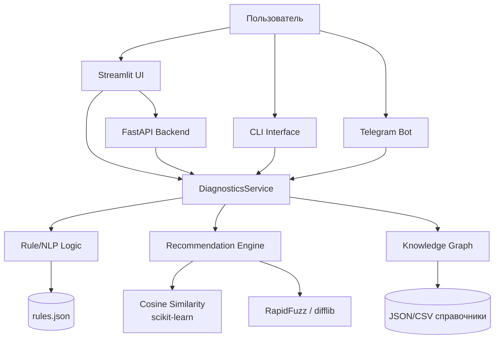

# UML / Архитектурная схема MedDiagnost

```mermaid
graph TD
    User[Пользователь] --> UI[Streamlit UI]
    UI --> Service[DiagnosticsService]
    UI --> API[FastAPI Backend]
    API --> Service

    Service --> Logic[Rule/NLP Logic]
    Service --> Reco[Recommendation Engine]
    Service --> KG[Knowledge Graph]

    Logic --> Rules[(rules.json)]
    KG --> RefData[(JSON/CSV справочники)]
    Reco --> Vec[Cosine Similarity\nscikit-learn]
    Reco --> Fuzzy[RapidFuzz / difflib]

    User --> CLI[CLI Interface]
    User --> TG[Telegram Bot]
    CLI --> Service
    TG --> Service
```
